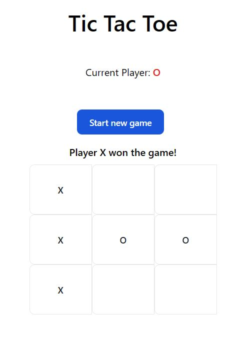

# Tic-Tac-Toe in Angular

This is a simple Tic-Tac-Toe game developed in Angular. It allows two players to compete in a classic Tic-Tac-Toe match, taking turns between "X" and "O" until there's a winner or a draw.

## Prerequisites

Before getting started, make sure you have Angular installed on your system. If not, you can install it by following the [official installation instructions](https://angular.io/guide/setup-local).

## Preview



## Installation

1. Clone the repository to your computer.

```
git clone https://github.com/andersonrbernal/tic-tac-toe.git
```

2. Navigate to the project directory.

```
cd angular-tic-tac-toe
```

3. Install the project's dependencies.

```
npm install
```

4. Start the application.
```
ng serve
```

Open a web browser and access http://localhost:4200/ to play the Tic-Tac-Toe game.

## Features

Two players can take turns to compete and win the game.
The game will automatically announce the winner or a draw.
You can restart the game at any time by clicking the "Restart" button.

## Contributing

If you wish to contribute to this project, feel free to fork the repository, make your changes, and submit a pull request. Be sure to follow the contribution guidelines.

## License

This project is licensed under the MIT License - see the LICENSE file for details.

## Author

Anderson Rodrigues Bernal

## Acknowledgments

We thank Angular for providing a powerful development framework to create this game.
